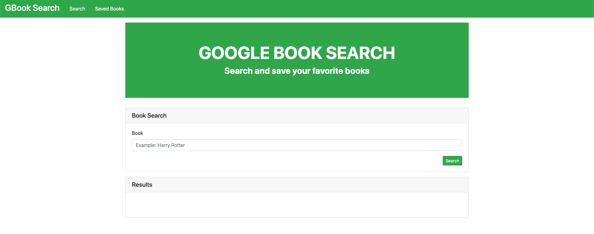

# Google Books Search App
Technologies used:
- `React.js`
- `Bootstrap`
- `API's`
- `Heroku` (Hosting and Deployment)
- `GitHub` (Hosting and Deployment)

## GitHub Repo
https://github.com/ejbronze/GoogleBooksSearch

## Heroku App (Working)
https://google-booksearcher.herokuapp.com/

# Starting the app locally

1. Start by installing front and backend dependencies. While in this directory, run the following command:

```
npm install
```
This should install node modules within the server and the client folder.

2. After installation is complete, run the following command in your terminal:

```
npm start
```
Your app should now be running on <http://localhost:3000>. The Express server should intercept any AJAX requests from the client.

# App Walkthrough

### Homepage

As of June 2019, the homepage looks like the image above.

### How The App Works:
1. On the Homepage, you'll see the following elements
    - A Navigation bar
    - Jumbotron section with the name of the app and it's use
    - Section to search for books
    - Results section
2. The elements are all styled using Bootstrap
3. When a user searches for a book, the app searches and scrapes the google books API for results, which are then sorted and displayed in the results section of the app.
4. Users can Save the searches under the Saved tab on the Navbar

### Future improvements and features:
